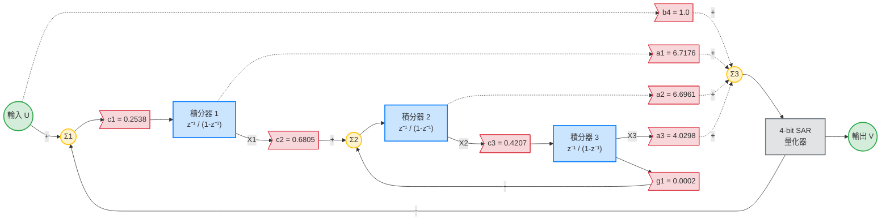

```mermaid
graph LR
    %% 樣式定義
    classDef inputOutput fill:#d4edda,stroke:#28a745,stroke-width:2px;
    classDef sumNode fill:#fff3cd,stroke:#ffc107,stroke-width:2px,shape:circle;
    classDef integrator fill:#cce5ff,stroke:#007bff,stroke-width:2px;
    classDef gainBlock fill:#f8d7da,stroke:#dc3545,stroke-width:1px;
    classDef quantizer fill:#e2e3e5,stroke:#6c757d,stroke-width:2px;

    %% 節點定義
    U((輸入 U)):::inputOutput
    V((輸出 V)):::inputOutput
    
    Sum1((Σ1)):::sumNode
    Sum2((Σ2)):::sumNode
    SumFF((Σ3)):::sumNode

    %% 【修復關鍵】：使用雙引號 "" 包裹文字，並用 <br> 換行以避免括號 () 導致的解析錯誤
    Int1["積分器 1<br>z⁻¹ / (1-z⁻¹)"]:::integrator
    Int2["積分器 2<br>z⁻¹ / (1-z⁻¹)"]:::integrator
    Int3["積分器 3<br>z⁻¹ / (1-z⁻¹)"]:::integrator

    GainC1>c1 = 0.2538]:::gainBlock
    GainC2>c2 = 0.6805]:::gainBlock
    GainC3>c3 = 0.4207]:::gainBlock

    GainA1>a1 = 6.7176]:::gainBlock
    GainA2>a2 = 6.6961]:::gainBlock
    GainA3>a3 = 4.0298]:::gainBlock
    
    GainB4>b4 = 1.0]:::gainBlock
    GainG1>g1 = 0.0002]:::gainBlock

    Quant["4-bit SAR<br>量化器"]:::quantizer

    %% 1. 主積分鏈路 (Integrator Chain)
    %% 【修復關鍵】：連線文字用雙引號 "" 包裹，避免 + 和 - 被解析為 Markdown 列表
    U -->|"+"| Sum1
    Sum1 --> GainC1 --> Int1
    
    Int1 -->|"X1"| GainC2 -->|"+"| Sum2
    Sum2 --> Int2
    
    Int2 -->|"X2"| GainC3 --> Int3
    Int3 -->|"X3"| GainA3

    %% 2. 局部諧振回授 (Local Resonator)
    Int3 --> GainG1 -->|"-"| Sum2

    %% 3. 前饋路徑 (Feed-Forward Paths) - 使用虛線表示
    U -.-> GainB4 -.->|"+"| SumFF
    Int1 -.-> GainA1 -.->|"+"| SumFF
    Int2 -.-> GainA2 -.->|"+"| SumFF
    GainA3 -.->|"+"| SumFF

    %% 4. 量化器與全局回授 (Global Feedback)
    SumFF --> Quant --> V
    Quant -->|"-"| Sum1
```